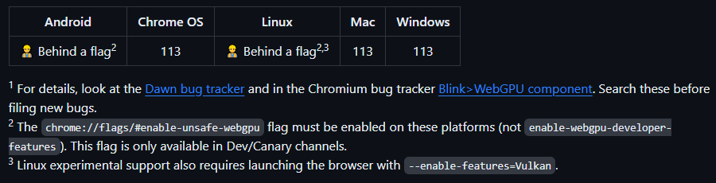

## Why do we try to do it?

Imagine that you have a decent model that could make using your application/website more interesting, but you:
- don't want to pay for hosting the model for inference and associated infrastructure
- make use of the end user hardware
- make use (if possible) of the end user GPU
- make it distributable to every architecture
- make the inference efficient (by using WASM)

WASM itself already partly answers the problem.

## WASM

WebAssembly (abbreviated _Wasm_) is a binary instruction format for a stack-based virtual machine. Wasm is designed as a portable compilation target for programming languages, enabling deployment on the web for client and server applications.

> *WebAssembly (Wasm) is generally faster than JavaScript for certain types of tasks. WebAssembly is a binary instruction format that allows developers to run code at near-native speed in modern web browsers. JavaScript, on the other hand, is a high-level scripting language that is often used for web development.*

https://graffersid.com/webassembly-vs-javascript/

So, it would be nice to have the inference part of your code written in WASM, to make it more optimized.

## How to run models with WASM in the browser

First, I would like to clarify that using WASM in the following examples practically means installing packages which contain WASM binaries or have been compiled entirely to WASM. 
Operations and functions which would run slower using vanilla JS can be rewritten in RUST and compiled to WASM, but JavaScript still interacts with WASM.

- ### Transformers.js

Transformers.js is designed to be functionally equivalent to Hugging Face’s transformers python library, meaning you can run the same pretrained models using a very similar API. The models support common tasks in different modalities, such as:
- 📝 Natural Language Processing: text classification, named entity recognition, question answering, language modeling, summarization, translation, multiple choice, and text generation.
- 🖼️ Computer Vision: image classification, object detection, and segmentation.
- 🗣️ Audio: automatic speech recognition and audio classification.
- 🐙 Multimodal: zero-shot image classification.

Transformers.js uses ONNX Runtime to run models in the browser. 
If you don't manage to find one of the numerous models from Hugging Face tailored to your needs (or you have finetuned your own model and want to use with Transformers.js), you can follow the path of converting your model, from popular formats (PyTorch, Tensorflow) to ONNX. 
(Transformers.js](https://huggingface.co/docs/transformers.js)
The [conversion to ONNX format](https://github.com/huggingface/optimum#onnx--onnx-runtime) (in case of Transformers.js for ONNX runtime) is rather easy with these commands:
```
pip install --upgrade-strategy eager optimum[onnxruntime]
optimum-cli inc quantize --model distilbert-base-cased-distilled-squad --output ./quantized_distilbert
```
As you can see optimum-cli makes it easy to perform quantization of your model, which allows to make a smaller file from the model weights. 
It is a good practice to load your model to verify that its accuracy after quantization is still acceptable for your use.

Advantages:
- Transformers.js library is very well documented
- extremely easy to use (syntax similar to HF transformers)
- surprisingly fast

Disadvantages:

As of now WebGPU support is not included. This means, that running larger models will be constrained to CPU architecture and may not be efficient.
However I recommend checking out their [projects repo](https://xenova.github.io/transformers.js/) for some impressive examples, they may be fast enough and not need GPU support.

### Simple Transformers.js app
I experimented with one of the examples on Transformers.js Github page: [react-translator](https://github.com/xenova/transformers.js/tree/main/examples/react-translator) to convert it to a [simple question answering app](https://github.com/justyna3773/text_manipulation_transformers_js.git).
I was impressed with how adaptable this example is, the only thing you have to change the pipeline from *translation* to *text2text-generation* to make the model generate answer instead of translating is MyTranslationPipeline class in worker.js file:

```js
import { pipeline } from '@xenova/transformers';

class MyTranslationPipeline {
    static task = 'text2text-generation';
    static model = 'Xenova/flan-t5-base';
    static instance = null;

    static async getInstance(progress_callback = null) {
        if (this.instance === null) {
            this.instance = pipeline(this.task, this.model, { progress_callback });
        }

        return this.instance;
    }
}

```
Essentially you change the name of the task and model ID from HuggingFace.
After that you run ```npm run dev``` and voila, you can access your App under local address: [http://localhost:5173/]()

* * *

## WebGPU

WebGPU exposes an API for performing operations, such as rendering and computation, on a Graphics Processing Unit.
It is still in the early stages, but Chrome enables it by default since April 2023 (version 113).





## Project which use WebGPU (tested with NVIDIA RTX 3060 on a laptop)
- ### Web-LLM
>*WebLLM is a modular, customizable javascript package that directly brings language model chats directly onto web browsers with hardware acceleration. **Everything runs inside the browser with no server support and is accelerated with WebGPU.** We can bring a lot of fun opportunities to build AI assistants for everyone and enable privacy while enjoying GPU acceleration.*
[Web-LLM demo](https://webllm.mlc.ai/)

Advantages:
If you are fine with your user downloading large model files then it works well. It also has a pretty extensive documentation.

Problems:
- initial downloading of the model is slow and the models supported are heavy (several GB). TinyLLama for example, takes 2 GB of your memory. 
- I experimented with disabling GPU support in the browser - then the chat does not work at all. This undermines the idea that we can have one app to run on all hardwares.
- customization capabilities - there is a limited number of model architectures it supports (Mistral, LLama, Red Pyjamas and a few others). You can add model weights from your finetuned model in easy fashion, however adding your own architecture is problematic.


Anyway, this project seems to have a lot of potential and well documented workflow on how to add your own model library. 
I wanted to add a small BERT model, to make it decently good for conversations or question but at the same time keep it as small as possible.  
I followed their workflow for adding new model library: [https://llm.mlc.ai/docs/deploy/javascript.html#bring-your-own-model-library](https://llm.mlc.ai/docs/deploy/javascript.html#bring-your-own-model-library) and couldn't reproduce the notebook results: [tutorial_add_new_model_architecture_in_tvm_nn_module.ipynb](https://github.com/mlc-ai/notebooks/blob/main/mlc-llm/tutorial_add_new_model_architecture_in_tvm_nn_module.ipynb)
Here is the link to the issue: [https://github.com/mlc-ai/web-llm/issues/274](https://github.com/mlc-ai/web-llm/issues/274)


- ### Web-StableDiffusion
 https://github.com/mlc-ai/web-stable-diffusion
 > *This project brings stable diffusion models onto web browsers. **Everything runs inside the browser with no server support.*** 
- Similar problems to Web-LLM - you have to have a lot of memory, as it downloads models which are not lightweight (but at least they are cached and you get a progress update while they download)
- It is slow in the first run


- ### Web ONNX

>Wonnx is a GPU-accelerated ONNX inference run-time written 100% in Rust, ready for the web.
(https://github.com/webonnx/wonnx)

What is ONNX runtime? Open Neural Network Exchange Runtime is a cross-platform inference and training machine-learning accelerator.
ONNX Runtime inference can enable faster customer experiences and lower costs, supports models from PyTorch and TensorFlow/Keras as well as classical machine learning libraries such as scikit-learn, LightGBM, XGBoost, etc. ONNX Runtime is compatible with different hardware, drivers, and operating systems, and provides optimal performance by leveraging hardware accelerators where applicable alongside graph optimizations and transforms.

Web ONNX has a WASM package version and can be installed with ```npm install @webonnx/wonnx-wasm```
I used their complete [example with squeeze model](https://github.com/webonnx/wonnx-wasm-example) for image classification with Vite bundler (bundler optimizes the project structure and enables communication between components written in different languages)
As part of this exercise I sought to bring this simple example to Github pages. 
It requires installing gh-pages package ```npm install gh-pages``` and updating the package.json file with the following lines:
```
"scripts":
"predeploy": "npm run build",
"deploy": "gh-pages -d dist",
```
As well as adding your Github pages link in the package.json file with:
```
  "homepage": "https://justyna3773.github.io/camera_classify_webgpu/",
```
After that you can deploy the app to Github pages with ```npm run deploy```
I did not manage, however, to overcome the problem with no inference being made when GPU is not available.
Link to the repo for real-time object classification from the camera: [https://github.com/justyna3773/camera_classify_webgpu](https://github.com/justyna3773/camera_classify_webgpu) and to the deployed app: [https://justyna3773.github.io/camera_classify_webgpu/](https://justyna3773.github.io/camera_classify_webgpu/)

When I tried to test WONNX with a small language model like BERT (since the authors claim that WONNX is tested with BERT architecture), I encountered a problem with inferring shapes when trying to prepare the model for inference with WONNX [https://github.com/webonnx/wonnx/issues/200](https://github.com/webonnx/wonnx/issues/200). As of now, it hasn't been resolved. 
In general, running language models with WONNX may be problematic, as the package does not implement all necessary operators for BERT architectures to work. For more details take a look at this post by one of major WONNX contributors: [https://t-shaped.nl/2023/running-ai-models-in-the-browser-using-wonnx](https://t-shaped.nl/2023/running-ai-models-in-the-browser-using-wonnx)

Summary: WONNX is helpful when you try to distribute models for image classification, like Squeezenet or ResNet, however it is not easily customized for usage with language models. 
